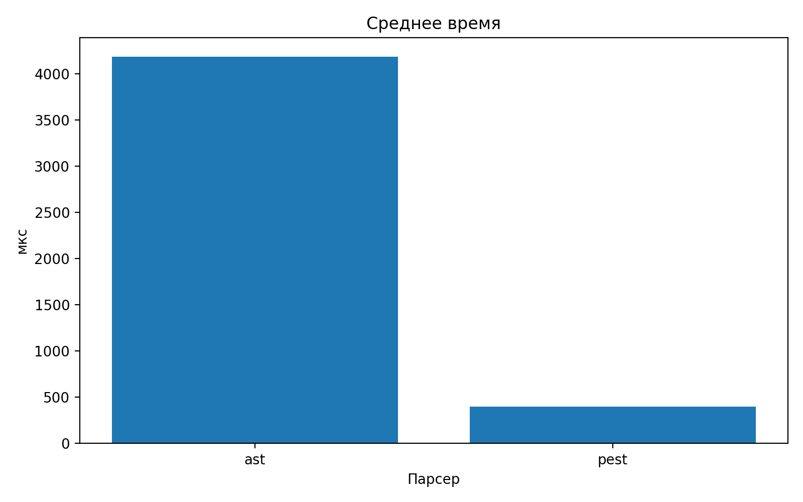
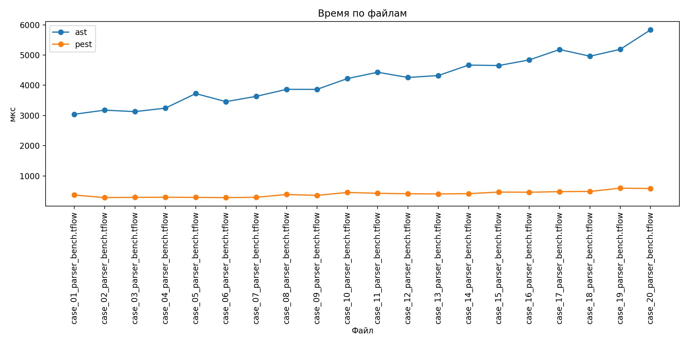

# Сравнение парсеров T-Flow

Для прошлого допа я довел до ума старый парсер с Ast

Он работает как recursive descent. То есть парсер идёт сверху вниз по структуре программы и вызывает отдельные функции для разных конструкций языка.

Сначала я попробовал сделать второй parser через LALRPOP - Это bison но для раст.

Но на практике  LALRPOP начал выдавать shift/reduce конфликты. К сожалению, быстро исправить я это не смог.

Поэтому я отказался от LALRPOP и выбрал...

## Какой выбрал 

Выбор пал на pest. Он идёт сверху вниз от стартового правила и пробует альтернативы в том порядке, в котором они записаны в грамматике

Это PEG grammar.

Похож на мой, но выбра среди генераторов парсеров на rust  не так много(

Ключевые отличия = проверяет вход по grammar-файлу и использует ordered choice, ну и не строит аст о чем далее.

Грамматика описывается отдельно в файле

```text
src/tflow_pest.pest
```

А сам запуск parser находится в

```text
src/pest_parser.rs
```

Запуск:

```bash
cargo run -- --pest examples/neighbors.tflow
```

## Датасет

Был сгенерирован, 20 файлов.

Папка:

```text
dataset/parser_bench
```

Каждый файл содержит больше 20 строк и использует основные конструкции


## Результаты

СРАЗУ СКАЖУ сравнение нечестное!!! Мой парсер строит аст, так что он заведомо тратит на это больше времени.





Видно, что при росте размера файла время работы `ast`  увеличивается сильнее. У `pest`  рост тоже есть, но он мизерный.

## Вывод

Для корректной оценки нужно было бы прикрутить старый парсер для vs. И тогда можно было бы сделать вывод о том насколько построение AST ест время. 
Но осонвываясь на текущих данных, pest работает значительно быстрее и скорость не падает заначительно в динамике.
